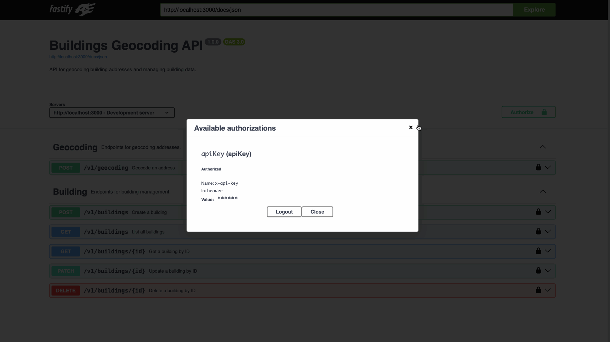

# Buildings & Geocoding API

This project implements a functional, documented, and testable MVP API for building metadata and address geocoding.

The backend is built with **Fastify**, **Zod**, and **OpenAPI**, following modern best practices for type safety,
modular architecture, and developer experience.

## Feature Coverage

- [x] `POST /geocoding`: Search addresses using mocked data with Swiss-format constraint
- [x] `GET /buildings`: List all buildings
- [x] `POST /buildings`: Create new building
- [x] `GET /buildings/:id`: Retrieve building by ID
- [x] `PATCH /buildings/:id`: Update a building (partial)
- [x] `DELETE /buildings/:id`: Remove a building
- [x] Authentication using `X-API-Key` header
- [x] OpenAPI spec + Swagger UI
- [x] Zod-based schema validations
- [x] Type-safe route inputs
- [x] Domain-level errors with detailed responses
- [x] Integration tests with `fastify.inject` and mocks

## Project Structure

Monorepo structured with [nx] following [package-based] pattern:

- [/packages](/packages/) - contains libraries and packages
  - [backend-api](/packages/backend-api/) – API code, like routes and configuration
  - [database-services](/packages/database-services/) - database services and helpers
  - [library-schemas](/packages/library-schemas/) – reusable schemas and types
  - [library-utils](/packages/library-utils/) – reusable utility helpers
  - [types](/packages/types/) – generic types shared between all packages

[nx]: https://nx.dev/getting-started/intro
[package-based]: https://nx.dev/tutorials/package-based-repo-tutorial

## Setup & Run

1. **Install dependencies:**

```bash
 npm install
```

2. **Run the development server**
   You can run the API using either standard npm or Nx commands.

- From the root folder (npm)

```bash
npm start
```

- Using Nx from any folder

```bash
npx nx start @challenge/backend-api
```

3. **Visit Swagger UI:**

- **Swagger UI**: [http://localhost:3000/docs](http://localhost:3000/docs)
- **OpenAPI Spec (JSON)**: [http://localhost:3000/docs/json](http://localhost:3000/docs/json)

## Nx Monorepo Usage

This project is built using the Nx monorepo toolchain. Each internal package (like backend-api, library-schemas, etc.) is treated as a standalone project.
View available scripts:

```bash
npm run
```

Run a task for a single project:

```bash
npx nx [task] [project]
# Example:
npx nx test @challenge/backend-api
```

Run a task for multiple projects:

```bash
npx nx run-many -t [task] -p [project1 project2]
```

## Demo



## OpenAPI Documentation

- Generated directly from route schemas using `zod-to-openapi`
- Automatically served via Swagger UI at `/docs`
- Supports live try-it-out with required headers

## Example Request

```bash
curl http://localhost:3000/v1/geocoding \
  --request POST \
  --header "Content-Type: application/json" \
  --header "X-API-KEY: api-key" \
  --data '{
    "searchText": "Berninastrasse",
    "limit": 3
  }'
```

## Testing

Tests use `fastify.inject` to simulate requests without starting a real server. Tests are defined for:

- API key validation
- Building routes
- Geocoding endpoint
- Error handling with domain-specific errors

Run tests from the root directory with:

```bash
npx nx test @challenge/backend-api
```

## Learnings

- Mapping Zod validation errors into OpenAPI-compliant responses requires custom error formatting.
- Generating OpenAPI specs from Zod works well but needs consistent schema definitions and transformation logic.
- Fastify with Zod and Swagger is a productive stack for building well-documented, secure APIs under time constraints.
- Error handling is much easier to scale and maintain when using structured, domain-specific error types instead of ad-hoc logic in route handlers.

## Design Decisions & Trade-offs

- **Mocked Geocoding Data**: Geocoding is mocked to showcase API structure, type safety, and OpenAPI integration. In production, this could be swapped for the Swiss geo.admin API.
- **In-memory Storage**: Buildings are stored in memory to simplify the MVP. Persistence could be added in the future.
- **Fastify + Zod + Swagger**: This stack enabled fast iteration, schema-first validation, and automatic OpenAPI generation via zod-to-openapi.
- **Error Handling**: Implemented custom error classes (e.g., BuildingNotFoundError) to cleanly separate domain logic from transport layer concerns.

## Known Limitations

- Geocoding results are static and do not use the real geoadmin API.
- Data is not persisted — all building data resets on server restart.
- API key validation uses a hardcoded list. No key management, rate limiting, or audit logging implemented.
- Only basic tests are included due to time constraints.

## Resources

- [Fastify Documentation](https://fastify.dev/docs/latest/) – Reference for route schemas, error handling, and plugins
- [Nx: Package-based Monorepo Guide](https://nx.dev/tutorials/package-based-repo-tutorial) – Used to structure the
  monorepo
- [Zod Documentation](https://zod.dev/?id=error-handling) – For schema validation and custom error formatting
- [zod-to-openapi](https://github.com/asteasolutions/zod-to-openapi) – Auto-generates OpenAPI docs from Zod schemas
- [Speakeasy Fastify OpenAPI Guide](https://www.speakeasy.com/openapi/frameworks/fastify) – For OpenAPI best practices
  with Fastify

- [fastify-swagger](https://github.com/fastify/fastify-swagger) – Generates Swagger/OpenAPI JSON
- [fastify-swagger-ui](https://github.com/fastify/fastify-swagger-ui) – Provides UI for OpenAPI docs
- [fastify-auth](https://github.com/fastify/fastify-auth) – Explored for `X-API-Key` middleware
- [Fastify Errors Reference](https://github.com/fastify/fastify/blob/main/docs/Reference/Errors.md#fastify-error-codes) –
  Used for shaping consistent error handling
- [Fastify Error Handling](https://fastify.dev/docs/latest/Reference/Errors/#error-handling-in-nodejs) – Node.js vs
  Fastify error best practices
- [`@asteasolutions/zod-to-openapi`](https://github.com/asteasolutions/zod-to-openapi) – Used for OpenAPI schema
  generation

## AI Assistance

During the development of this project, I utilized [Trae AI](https://www.trae.ai/), an AI-powered coding assistant, to
enhance productivity and code quality. Trae AI offers features such as:

- **Code Completion**: Provides intelligent code suggestions to speed up development.
- **Code Explanation**: Helps in understanding and documenting complex code segments.
- **Bug Detection**: Assists in identifying and resolving potential issues in the codebase.

By integrating Trae AI into my workflow, I was able to streamline the development process, focusing more on core
functionalities and less on repetitive tasks.

Additionally, I used Grammarly to review and refine written documentation, ensuring clear and professional communication
throughout the project.
